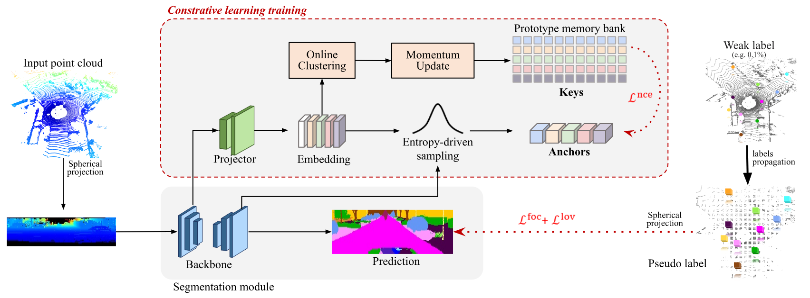

**COARSE3D: Class-Prototypes for Contrastive Learning in Weakly-Supervised 3D Point Cloud Segmentation (BMVC 2022)** 

[Rong Li <sup>1</sup>](https://rongli.tech/),
[Anh-Quan Cao <sup>2</sup>](https://anhquancao.github.io),
[Raoul de Charette <sup>2</sup>](https://team.inria.fr/rits/membres/raoul-de-charette/)  
<sup>1</sup>SCUT, China. <sup>2</sup>Inria, France


[](https://arxiv.org/pdf/2210.01784.pdf)

<!------>



If you find this work or code useful, please cite our [paper](https://arxiv.org/pdf/2210.01784.pdf) and [give this repo a star](https://github.com/cv-rits/COARSE3D/stargazers):
```
@inproceedings{coarse3d,
title={COARSE3D: Class-Prototypes for Contrastive Learning in Weakly-Supervised 3D Point Cloud Segmentation},
author={Rong Li, Anh-Quan Cao and Raoul de Charette},
booktitle={BMVC},
year={2022},
}
```

# Teaser


# Content
- [Teaser](#teaser)
- [Content](#content)
  - [Environment](#environment)
  - [Preparing Dataset](#preparing-dataset)
    - [SemanticKITTI](#semantickitti)
    - [SemanticPOSS](#semanticposs)
    - [nuScenes](#nuscenes)
  - [Training](#training)
  - [Trained Models](#trained-models)
  - [Acknowledgement](#acknowledgement)
  - [License](#license)


## Environment
1. Create environment.
    ```
    conda create -n coarse3d python==3.8
    conda activate coarse3d
    ```
2. Install dependencies.
    ```
    conda install pytorch==1.8.0 torchvision==0.9.0 torchaudio==0.8.0 cudatoolkit=10.2 -c pytorch
    pip install -r requirements.txt
    ```
3. Git clone and enter repo.
    ```
    git clone https://github.com/cv-rits/COARSE3D
    cd COARSE3D
    ```
       


## Preparing Dataset
### SemanticKITTI

1. Download [SemanticKITTI](http://semantic-kitti.org/dataset.html) dataset:
    - Download KITTI Odometry Benchmark Velodyne point clouds (80 GB)
    - Download SemanticKITTI label data (179 MB)

2. Enter subdir.
    ```
    cd tasks/prepare_data/
    ```

3. Set params in the `gen_sem_weak_label_rand_grid.py`, more details provided in the help comments of the parser.
4. Train
    ```
    python gen_sem_weak_label_rand_grid.py
    ```
    
    Then, the dataset strcuture should be like:
    
    ```
    └── semantic-kitti-coarse3d
        └── sequences
            ├── 00
            │   └── xxx # weakly-sup label
            ├── 01
            ...
            ...
    ```


### SemanticPOSS

1. Download [SemanticPOSS](http://www.poss.pku.edu.cn/download.html) dataset:
    - LiDAR point cloud and label (2.2G)

2. Enter subdir.
    ```
    cd tasks/prepare_data/
    ```
3. Set params in the `gen_sem_weak_label_rand_grid.py`, more details provided in the help comments of the parser.

4. Generate weak label.
    ```
    python gen_sem_weak_label_rand_grid.py
    ```
    then, the data structure of weak label should be like:
    ```
    └── semantic-poss-coarse3d
        └── sequences
            ├── 00
            │   └── xxx # weakly-sup label
            ├── 01
            ...
            ...
    ```
    

### nuScenes

1. Register and download [nuScenes-lidarseg](https://www.nuscenes.org/nuscenes#download) dataset.

2. Enter subdir.
    ```
    cd tasks/prepare_data/
    ```

3. Set params in the `gen_nuscenes_weak_label_rand_grid.py`, more details provided in the help comments of the parser.

4. Generate weak label.
    
    ```
    python gen_nuscenes_weak_label_rand_grid.py
    ```
    Then, the data structure should be like:
    ```
    └── nuscenes-coarse3d
       └── v1.0-trainval
            ├── 6d164dadab534fb087413b807bcf1de3_xxx.npy  # weakly-sup label
            ├── 6d0eb63329684744b3a6ffd4fbab830c_xxx.npy  # weakly-sup label
            ...
            ...
    ```
    

## Training 

1. Download [ImageNet pretrained model](https://drive.google.com/file/d/12eFcX5waDEQBOUOgs7L63XkXU3-2HpZG/view?usp=sharing).
 
2. Enter sub dir.
    ```
    cd tasks/weak_segmentation
    ```

3. Adapt `config_dataset.yaml` file (e.g. `config_semantic_kitti.yaml`), details are provided in the comments.

4. Adapt `run.sh` file. Replace the `config_dataset.yaml` with the dataset you are interested.

5. Train.
    ```
    bash run.sh
    ```


## Trained Models


 **Dataset**   | **Anno. (%)** | **Val mIoU (%)** | **Trained Model** 
:-------------:|:--------------:|:------------:|:-----------------:
 SemanticKITTI | 0.01          | 47.35        | [link](https://github.com/astra-vision/COARSE3D/releases/download/weights/SemanticKITTI_0.01percent.pth)  
  </br>        | 0.1           | 57.57        | [link](https://github.com/astra-vision/COARSE3D/releases/download/weights/SemanticKITTI_0.1percent.pth)  
 SemanticPOSS  | 0.01          | 31.10        | [link](https://github.com/astra-vision/COARSE3D/releases/download/weights/SemanticPOSS_0.01_percent.pth)  
  </br>        | 0.1           | 43.00        | [link](https://github.com/astra-vision/COARSE3D/releases/download/weights/SemanticPOSS_0.1_percent.pth)  
 nuScenes      | 0.01          | 42.90        | [link](https://github.com/astra-vision/COARSE3D/releases/download/weights/nuscenes_0.01_percent.pth)  
  </br>        | 0.1           | 58.70        | [link](https://github.com/astra-vision/COARSE3D/releases/download/weights/nuscenes_0.1_percent.pth)

<!--- 
Download the trained model you are interested, and put it on the `checkpoint` of config file. 
--->


## Acknowledgement
 Rong Li was supported by the SMIL lab of South China University of Technolog, received support and advices from Prof. Mingkui Tan, Prof. Caixia Li and Zhuangwei Zhuang. Inria members were partly funded by French project SIGHT (ANR-20-CE23-0016). This work was performed using HPC resources from GENCI–IDRIS (Grant 2021-AD011012808 and 2022-AD011012808R1). We would also like to thank Ivan Lopes for the video voice-over.


## License
COARSE3D is released under the [Apache 2.0 license](./LICENSE).  
